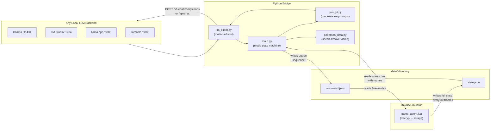

# Lateral Red (LR-1) -- Revised Implementation Plan

## Architecture




## Project Structure

```
llm-plays-pokemon/
  config.json               # Multi-backend LLM config, memory addresses, timing
  requirements.txt          # requests (sole dependency)
  lua/
    game_agent.lua          # mGBA script: decrypt RAM, detect mode, write state, exec commands
  bridge/
    __init__.py
    main.py                 # Main loop, mode state machine, action->button translator
    llm_client.py           # Universal LLM client (Ollama / OpenAI-compat)
    prompt.py               # Mode-aware prompt builder + response parser
    pokemon_data.py         # Species names (386), move names (354), type/nature tables
  data/
    .gitkeep                # Runtime JSON exchange (state.json, command.json)
```

---

## Component 1: Lua Game Agent -- [lua/game_agent.lua](lua/game_agent.lua)

Runs inside mGBA (v0.10+) via Tools > Scripting. Registered on `callbacks:add("frame", fn)`.

### Memory Map (FireRed US v1.0 / BPRE)

**Pointers (IWRAM):**

- `0x03005008` -- Save block 1 pointer (map/player data via DMA)
- `0x0300500C` -- Save block 2 pointer (trainer data via DMA)

**Player & Map (via DMA dereference):**

- `[0x03005008] + 0x000` -- Player/Camera X (2 bytes, signed)
- `[0x03005008] + 0x002` -- Player/Camera Y (2 bytes, signed)
- `[0x03005008] + 0x004` -- Map number (1 byte)
- `[0x03005008] + 0x005` -- Map bank (1 byte)

**Fixed EWRAM addresses:**

- `0x02031DBC` -- Current map bank (1 byte, backup)
- `0x02031DBD` -- Current map number (1 byte, backup)
- `0x0203707B` -- Player is actually moving (1 byte, 0/1)
- `0x0203707E` -- All OW movement locked (1 byte, 0/1 -- set during menus/cutscenes)

**Dialog / Text:**

- `0x02021D18` -- Current string being displayed in message box (variable length, Gen 3 charset, `0xFF` = terminator)

**Battle:**

- `0x02022B4C` -- Battle type flags (4 bytes; nonzero = in battle)

**Player Party (6 x 100 bytes starting at `0x02024284`):**
Each Pokemon is a 100-byte structure (Bulbapedia Gen III format):

Unencrypted header (bytes 0x00-0x1F):

- `+0x00` (4B): Personality Value (PV)
- `+0x04` (4B): OT ID
- `+0x08` (10B): Nickname (Gen 3 charset)

Encrypted data (bytes 0x20-0x4F, 48 bytes = 4 substructures x 12 bytes):

- Decryption key = `PV XOR OTID`
- XOR each 32-bit word of the 48 bytes with this key
- Substructure order determined by `PV % 24` (24 permutations of G/A/E/M)
- **Growth substructure**: species ID (2B), held item (2B), experience (4B), PP bonuses (1B), friendship (1B)
- **Attacks substructure**: move1-4 IDs (2B each), PP1-4 (1B each) -- this is what we need for movesets

Unencrypted battle stats (bytes 0x50-0x63, only present for party, not PC):

- `+0x50` (4B): Status condition bitfield (SLP bits 0-2, PSN bit 3, BRN bit 4, FRZ bit 5, PAR bit 6, TOX bit 7)
- `+0x54` (1B): Level
- `+0x56` (2B): Current HP
- `+0x58` (2B): Max HP
- `+0x5A` (2B): Attack
- `+0x5C` (2B): Defense
- `+0x5E` (2B): Speed
- `+0x60` (2B): Sp. Attack
- `+0x62` (2B): Sp. Defense

**Enemy Party (during battle, 6 x 100 bytes starting at `0x0202402C`):**

- Same structure as player party. Read the lead enemy Pokemon for battle context.

### Gen 3 Substructure Decryption (Lua implementation)

```lua
local SUBSTRUCTURE_ORDER = {
  [0]  = "GAEM", [1]  = "GAME", [2]  = "GEAM", [3]  = "GEMA",
  [4]  = "GMAE", [5]  = "GMEA", [6]  = "AGEM", [7]  = "AGME",
  [8]  = "AEGM", [9]  = "AEMG", [10] = "AMGE", [11] = "AMEG",
  [12] = "EGAM", [13] = "EGMA", [14] = "EAGM", [15] = "EAMG",
  [16] = "EMGA", [17] = "EMAG", [18] = "MGAE", [19] = "MGEA",
  [20] = "MAGE", [21] = "MAEG", [22] = "MEGA", [23] = "MEAG",
}

function decryptSubstructures(base)
  local pv   = emu:read32(base + 0x00)
  local otid = emu:read32(base + 0x04)
  local key  = bit32.bxor(pv, otid)
  local order = SUBSTRUCTURE_ORDER[pv % 24]

  -- Decrypt 48 bytes (12 words) into a flat array
  local words = {}
  for i = 0, 11 do
    words[i] = bit32.bxor(emu:read32(base + 0x20 + i * 4), key)
  end

  -- Find which 3-word (12-byte) block holds Attacks ("A")
  local a_pos = string.find(order, "A") - 1  -- 0-indexed block
  local a_off = a_pos * 3  -- word offset

  -- Extract 4 move IDs + 4 PPs from the Attacks substructure
  local move1 = bit32.band(words[a_off], 0xFFFF)
  local move2 = bit32.rshift(words[a_off], 16)
  -- ... etc for moves 3-4 and PPs from words[a_off+1] and [a_off+2]

  -- Similarly find Growth ("G") block for species ID
  local g_pos = string.find(order, "G") - 1
  local g_off = g_pos * 3
  local species = bit32.band(words[g_off], 0xFFFF)

  return species, {move1, move2, ...}, {pp1, pp2, ...}
end
```

### Game Mode Detection

The Lua script determines the current mode each state tick:

- `**battle**`: `emu:read32(0x02022B4C) ~= 0`
- `**dialog**`: text buffer at `0x02021D18` contains non-`0x00`/non-`0xFF` bytes
- `**menu**`: `emu:read8(0x0203707E) == 1` AND not in battle AND no dialog (movement locked by start menu or cutscene)
- `**overworld**`: none of the above

The mode is included in `state.json` as `"game_mode"`.

### State JSON Schema (expanded)

```json
{
  "frame": 54321,
  "game_mode": "battle",
  "player_x": 10,
  "player_y": 5,
  "map_bank": 3,
  "map_number": 1,
  "is_moving": false,
  "movement_locked": true,
  "text_on_screen": "",
  "battle_type": 1,
  "party": [
    {
      "species_id": 6,
      "nickname": "CHARIZARD",
      "level": 36,
      "hp": 102,
      "max_hp": 115,
      "attack": 78,
      "defense": 65,
      "speed": 88,
      "sp_attack": 95,
      "sp_defense": 72,
      "status": 0,
      "moves": [53, 52, 14, 126],
      "pp": [15, 10, 30, 5],
      "held_item_id": 0
    }
  ],
  "enemy": [
    {
      "species_id": 20,
      "level": 34,
      "hp": 89,
      "max_hp": 89,
      "moves": [162, 158, 28, 98],
      "pp": [20, 15, 15, 10]
    }
  ]
}
```

- `party` always has up to 6 entries (all Pokemon in the party, full data).
- `enemy` is populated only when `game_mode == "battle"`.
- All IDs (species, moves, items) are raw integers; Python does name resolution.

### Button Execution

mGBA key bitmask constants (`C.GBA_KEY`): A=0, B=1, SELECT=2, START=3, RIGHT=4, LEFT=5, UP=6, DOWN=7, R=8, L=9.

The Lua script reads `command.json` which contains a list of button-sequence steps:

```json
{
  "steps": [
    {"keys": 64, "frames": 8},
    {"keys": 0,  "frames": 4},
    {"keys": 1,  "frames": 8}
  ]
}
```

Each step holds the key bitmask via `emu:setKeys(keys)` for `frames` frames, then moves to the next step. This allows multi-press macros (e.g. "press Down, wait, press A" for menu navigation).

---

## Component 2: Pokemon Data Tables -- [bridge/pokemon_data.py](bridge/pokemon_data.py)

Python-side lookup tables so the Lua script stays lightweight (sends raw IDs only).

- `SPECIES_NAMES`: dict mapping Gen 3 index (1-386) to name string (e.g. `{1: "Bulbasaur", ..., 6: "Charizard", ...}`)
- `MOVE_NAMES`: dict mapping Gen 3 move index (1-354) to name string (e.g. `{1: "Pound", 53: "Flamethrower", ...}`)
- `MOVE_TYPES`: dict mapping move index to type string
- `TYPE_NAMES`: list of the 18 types
- `NATURE_NAMES`: list of 25 natures (derived from PV % 25)
- `STATUS_NAMES`: function to decode the status condition bitfield into human text
- `MAP_NAMES`: dict mapping `(bank, number)` tuple to location name for ~80 key FireRed locations

This file is large but static data only. It will be generated from well-known community resources (Bulbapedia index lists).

---

## Component 3: LLM Client -- [bridge/llm_client.py](bridge/llm_client.py)

Universal client that auto-detects or is configured for any local backend.

### Supported Backends

- **Ollama** -- native API at `http://localhost:11434/api/chat` (streaming JSON) or its OpenAI-compatible endpoint at `http://localhost:11434/v1/chat/completions`
- **LM Studio** -- OpenAI-compatible at `http://localhost:1234/v1/chat/completions`
- **llama.cpp server** -- OpenAI-compatible at configurable host:port `/v1/chat/completions`
- **llamafile** -- same OpenAI-compatible format
- **Any cloud API** -- same format with optional API key header

### Config-driven

```json
{
  "llm": {
    "backend": "openai-compat",
    "base_url": "http://localhost:11434",
    "model": "qwen2.5:7b",
    "temperature": 0.3,
    "max_tokens": 300,
    "api_key": null,
    "timeout_seconds": 30
  }
}
```

- `backend`: `"openai-compat"` (works with all of the above) or `"ollama"` (native Ollama API)
- `base_url`: just the host:port, client appends the path
- `api_key`: set only for cloud providers, `null` for local
- Uses only `requests` library (no openai SDK dependency -- keeps it lightweight)

### Recommended Small Models for Laptop Testing

- **Qwen 2.5 7B Q4_K_M** -- strong instruction following, good structured output
- **Llama 3.1 8B Q4_K_M** -- well-rounded, widely available
- **Mistral 7B Q4_K_M** -- fast, good reasoning
- **Phi-3 Mini 3.8B Q4_K_M** -- ultralight, fits 8GB RAM
- **Gemma 2 2B** -- minimal footprint for very constrained hardware

---

## Component 4: Mode-Aware Prompt System -- [bridge/prompt.py](bridge/prompt.py)

This is the core "brain". The prompt changes based on the detected game mode.

### System Prompt (constant across all modes)

Establishes the LLM as an autonomous Pokemon FireRed trainer. Kept short for small model context windows:

- Role, goal (beat the Elite Four), personality
- Response format: always JSON `{"narrative": "...", "action": "..."}`
- JSON output keeps parsing reliable even on 3B-parameter models

### Mode-Specific Turn Prompts

Each turn, the prompt includes the game state and a mode-specific action menu. The LLM picks exactly one action.

**Mode: `overworld`**

State shown: position, map name, party summary (names + HP%).
Available actions:

- `move_up`, `move_down`, `move_left`, `move_right` -- walk one tile
- `interact` -- press A (talk to NPC, pick up item, read sign)
- `open_menu` -- press START
- `wait` -- do nothing

**Mode: `dialog`**

State shown: text currently on screen, whether it looks like a YES/NO prompt.
Available actions:

- `continue` -- press A to advance text
- `choose_yes` -- navigate to YES and confirm
- `choose_no` -- navigate to NO and confirm

**Mode: `battle`**

State shown:

- Your active Pokemon: name, level, HP/MaxHP, status, 4 moves with PP and type
- Enemy Pokemon: name, level, HP/MaxHP, status (if visible)
- Full party roster (names, HP%, so LLM can decide to switch)

Available actions:

- `fight_move_1`, `fight_move_2`, `fight_move_3`, `fight_move_4` -- select FIGHT then the move. Prompt shows move name + PP + type next to each.
- `switch_1` through `switch_6` -- select POKEMON then pick slot
- `use_item` -- open BAG (simplified; could expand later)
- `run` -- attempt to flee (wild battles only)

The Python bridge translates these into multi-step button sequences. For example, `fight_move_2` becomes:

1. Press A (select FIGHT from main menu -- cursor defaults there)
2. Wait 4 frames
3. Press RIGHT (move cursor from move 1 to move 2)
4. Wait 4 frames
5. Press A (confirm move selection)

**Mode: `menu` (START menu)**

State shown: which menu is open.
Available actions:

- `menu_pokemon`, `menu_bag`, `menu_save`, `menu_close`
- These translate to appropriate D-pad + A sequences to navigate the start menu

### Response Parsing

Expects JSON: `{"narrative": "...", "action": "..."}`. Parser:

1. Try `json.loads()` on the full response
2. If that fails, regex-extract JSON from markdown code fences or surrounding text
3. Validate `action` is in the allowed set for the current mode
4. Fallback: if parse fails 3 times, send `wait` / `continue` (mode-appropriate safe default)

### Anti-Loop / "Compass" System

Tracked in `bridge/main.py`:

- Rolling window of last N positions + actions
- If same `(x, y, map)` for >5 turns: inject "WARNING: You have been in the same spot for several turns. Try a different direction."
- If same action repeated >3 times: inject "You keep doing the same thing. Consider a new approach."
- If in battle and using a move with 0 PP: the prompt excludes that move from the action list entirely

---

## Component 5: Main Loop & State Machine -- [bridge/main.py](bridge/main.py)

### Action-to-Button Translator

Maps high-level actions to `command.json` button sequences. Key mapping reference:

```python
KEY = {"A": 1, "B": 2, "SELECT": 4, "START": 8,
       "RIGHT": 16, "LEFT": 32, "UP": 64, "DOWN": 128, "R": 256, "L": 512}

ACTION_SEQUENCES = {
    "move_up":    [{"keys": KEY["UP"], "frames": 16}],
    "move_down":  [{"keys": KEY["DOWN"], "frames": 16}],
    "interact":   [{"keys": KEY["A"], "frames": 8}],
    "continue":   [{"keys": KEY["A"], "frames": 8}],
    "open_menu":  [{"keys": KEY["START"], "frames": 8}],
    "fight_move_1": [
        {"keys": KEY["A"], "frames": 6}, {"keys": 0, "frames": 4},  # FIGHT
        {"keys": KEY["A"], "frames": 6},                              # Move 1 (top-left default)
    ],
    "fight_move_2": [
        {"keys": KEY["A"], "frames": 6}, {"keys": 0, "frames": 4},
        {"keys": KEY["RIGHT"], "frames": 4}, {"keys": 0, "frames": 2},
        {"keys": KEY["A"], "frames": 6},
    ],
    "fight_move_3": [
        {"keys": KEY["A"], "frames": 6}, {"keys": 0, "frames": 4},
        {"keys": KEY["DOWN"], "frames": 4}, {"keys": 0, "frames": 2},
        {"keys": KEY["A"], "frames": 6},
    ],
    "fight_move_4": [
        {"keys": KEY["A"], "frames": 6}, {"keys": 0, "frames": 4},
        {"keys": KEY["DOWN"], "frames": 4}, {"keys": 0, "frames": 2},
        {"keys": KEY["RIGHT"], "frames": 4}, {"keys": 0, "frames": 2},
        {"keys": KEY["A"], "frames": 6},
    ],
    "run": [
        {"keys": KEY["RIGHT"], "frames": 4}, {"keys": 0, "frames": 2},
        {"keys": KEY["DOWN"], "frames": 4}, {"keys": 0, "frames": 2},
        {"keys": KEY["A"], "frames": 6},
    ],
    # ... switch, menu, choose_yes/no, etc.
}
```

### Main Loop

```python
while True:
    state = wait_for_new_state("data/state.json")
    enriched = enrich_with_names(state)        # species/move IDs -> names
    mode = enriched["game_mode"]
    allowed_actions = get_actions_for_mode(mode, enriched)
    prompt = build_prompt(enriched, allowed_actions, history)
    response = llm_client.chat(prompt)
    narrative, action = parse_response(response, allowed_actions)
    print(f"[{mode.upper()}] {narrative}")
    button_seq = ACTION_SEQUENCES[action]
    write_command("data/command.json", button_seq)
    history.append({"state": enriched, "action": action, "narrative": narrative})
```

---

## Component 6: Configuration -- [config.json](config.json)

```json
{
  "llm": {
    "backend": "openai-compat",
    "base_url": "http://localhost:11434",
    "model": "qwen2.5:7b",
    "temperature": 0.3,
    "max_tokens": 300,
    "api_key": null,
    "timeout_seconds": 30
  },
  "data_dir": "data",
  "state_poll_interval_seconds": 0.5,
  "history_length": 10,
  "lua": {
    "frame_poll_interval": 30
  }
}
```

---

## Prerequisites (ZorinOS / Ubuntu)

1. **mGBA** (v0.10.5+): `sudo apt install mgba-qt` or build from [mgba.io](https://mgba.io)
2. **Python 3.10+**: pre-installed on ZorinOS; `pip install -r requirements.txt`
3. **Any one LLM backend:**
  - Ollama: `curl -fsSL https://ollama.com/install.sh | sh && ollama pull qwen2.5:7b`
  - LM Studio: download from [lmstudio.ai](https://lmstudio.ai), load a GGUF model, start server
  - llama.cpp: build from source, run `./llama-server -m model.gguf`
  - llamafile: download a single-file executable model from HuggingFace
4. **Pokemon FireRed ROM** (US v1.0, game code BPRE) -- user-supplied, not included

## Running

1. Start your chosen LLM backend (e.g. `ollama serve`)
2. Open mGBA, load the FireRed ROM
3. In mGBA: Tools > Scripting > File > Load `lua/game_agent.lua`
4. `python3 -m bridge.main` from project root
5. Watch the AI play and narrate in the terminal

